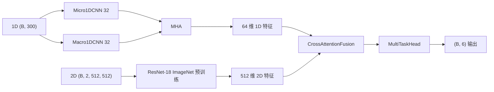
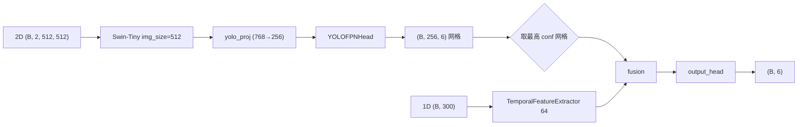
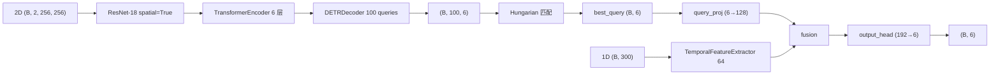
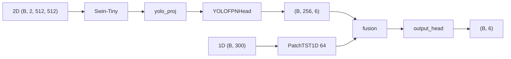
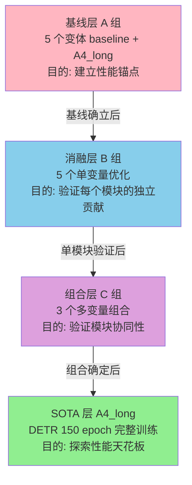

# PE-MMNet v4 模型研发进展汇报

---

## 一、项目背景

**PE-MMNet v4（Physics-Enhanced Multi-Modal Network）**：基于深度学习的日用陶瓷热震裂纹实时预测系统。**多模态融合**架构，同时处理：
- **1D 温度时序**（300 个时间步）
- **2D 温度场 + 应力场图像**（512×512×2 通道）

输出：检测向量 `[x, y, l, w, conf, density]`（位置、尺寸、置信度、裂纹密度）

**物理约束**（设计动机）：
- 裂纹密度随温度下降单调递增（格里菲斯断裂准则）
- 裂纹不可逆
- 裂纹位置与应力集中区域相关

---

## 二、模型架构总览

### 2.1 变体清单（5 个）

| # | 变体 | 架构 | 显存 | 用途 |
|---|------|------|------|------|
| 1 | `resnet18` | ResNet-18 + Cross-Attention | ~2GB | 轻量基线，**所有优化的基准线** |
| 2 | `swin_yolo` | Swin-Tiny + YOLO-FPN + Cross-Attention | ~4GB | **空间网格定位**，YOLO 网格回归 |
| 3 | `vit_yolo` | ViT-Small + YOLO-FPN + Cross-Attention | ~3GB | 全局自注意力骨干 |
| 4 | `detr` | ResNet-18 + Transformer + Hungarian Matching | ~5GB | **全局上下文端到端检测**，100 Object Queries |
| 5 | `swin_yolo_patchtst` | Swin-Tiny + YOLO-FPN + PatchTST | ~4GB | 时序骨干升级（PatchTST） |

### 2.2 模型选型决策（为什么是这 5 个）

**硬件约束**：当前 GPU 8.5GB 显存（L3），所有候选必须满足 batch≥4 + FP16 可跑。

#### 2.2.1 2D 骨干候选

| 候选 | 选/不选 | 理由 |
|------|--------|------|
| **ResNet-18** | ✅ 选 | 轻量稳定，8.5GB 显存跑得动，作为所有优化的 baseline |
| ResNet-50/101 | ❌ 不选 | 8.5GB 显存 OOM（实测 batch=4 都吃力） |
| **Swin-Tiny** | ✅ 选 | 局部窗口注意力 + 多尺度 FPN，detection 友好（YOLO/DETR 头部都需要） |
| Swin-Small/Base | ❌ 不选 | 显存不够；Swin-Small 比 Swin-Tiny 大 2 倍 |
| **ViT-Small** | ✅ 选 | 全局自注意力 vs Swin 局部注意力，对比验证哪种更适合本任务 |
| ConvNeXt-Tiny | ❌ 不选 | 训练慢，性价比低；224 固定输入不友好 |
| EfficientNet-B0 | ❌ 不选 | 精度低，MBConv 推理慢 |
| MobileNetV3 | ❌ 不选 | 精度不够（可作 ablation 备选） |

#### 2.2.2 检测头候选

| 候选 | 选/不选 | 理由 |
|------|--------|------|
| **YOLO 网格** | ✅ 选 | 简单、密集预测、detection 友好（16×16=256 网格） |
| **DETR** | ✅ 选 | 端到端、全局上下文，**对比 YOLO 范式**（anchor-free vs Hungarian） |
| RetinaNet | ❌ 不选 | focal loss 已被 YOLO/DETR 超越 |
| Faster R-CNN | ❌ 不选 | 2-stage 推理太慢，不适合实时 |
| Deformable DETR | 🟡 候选 | 下版本（v4.7） |
| RT-DETR | ❌ 不选 | 太新，未充分验证 |

#### 2.2.3 1D 时序骨干候选

| 候选 | 选/不选 | 理由 |
|------|--------|------|
| **CNN+Attention**（Micro/Macro 1D） | ✅ 选 | 轻量、已验证为 baseline |
| **PatchTST** | ✅ 选 | 长序列建模（patch 机制），对比 CNN+Attention |
| Transformer (vanilla) | ❌ 不选 | PatchTST 已涵盖（patch + Transformer） |
| DLinear | ❌ 不选 | 简单线性，实验已显示比 CNN 略差 |
| Informer | ❌ 不选 | 长序列设计冗余（300 步不需要稀疏注意力） |

#### 2.2.4 多模态融合候选

| 候选 | 选/不选 | 理由 |
|------|--------|------|
| **Cross-Attention** | ✅ 默认 | 标准做法（2D 作 Q，1D 作 K/V） |
| **Gated Fusion** | ✅ B1 | 验证门控 vs attention（不同信息流） |
| Concat | ❌ 不选 | 简单但效果差 |
| Bilinear Pooling | ❌ 不选 | 计算量太大 |

#### 2.2.5 注意力机制候选（B2）

| 候选 | 选/不选 | 理由 |
|------|--------|------|
| SE | ❌ 不选 | 只用通道维度，丢失位置 |
| ECA | ❌ 不选 | 同上 |
| CBAM | ❌ 不选 | 同上 |
| **CoordAtt (B2)** | ✅ 选 | **保留位置 + 通道双维度**，是本项目原创改进点 |
| Self-Attention | ❌ 不选 | 已被 ViT/Swin 替代 |

#### 2.2.6 优化策略候选（B 组）

| 候选 | 选/不选 | 理由 |
|------|--------|------|
| 门控融合 | ✅ B1 | 见 2.2.4 |
| 坐标注意力 | ✅ B2 | 见 2.2.5（**原创**） |
| 分阶段训练 | ✅ B3 | 短序列预训练 → 长序列微调，避免过拟合 |
| 三通道输入 | ✅ B4 | 增加 [初始温度, 当前温度, 变化率]，强化时序信息 |
| ThermalCutMix | ✅ B5 | 物理安全数据增强（仅作用于温度通道，保护应力场物理意义） |
| 全组合 | ✅ C1/C2/C3 | 模块化消融，对比各模块贡献度 |

### 2.3 各变体原理（mermaid 流程图）

#### ① resnet18（PETSNetMultimodal）



- **1D 分支**：Micro/Macro 双尺度 1D-CNN 提取局部+全局温度模式 → MHA 通道融合
- **2D 分支**：ResNet-18 ImageNet 预训练提取空间特征
- **融合**：CrossAttentionFusion（512-dim 2D 作为 Q，64-dim 1D 作为 K/V）

#### ② swin_yolo（SwinYOLOFPN）



- **YOLO 网格回归**：16×16=256 个网格点，每个点预测 [x, y, l, w, conf, density]
- **训练**：返回 (B, 256, 6) 完整网格；**推理**：取最高 conf 网格 → fusion

#### ③ vit_yolo（ViTYOLOFPN）

类似 swin_yolo，但 2D 骨干换成 ViT-Small (timm `vit_small_patch16_224`)：
- 加 `input_resize` 层（Conv2d 2→3 + 512→224 双线性插值）适配 ViT 固定输入
- actual_grid_size 动态计算：`max(16, (image_size//32 // 4) * 4)`

#### ④ detr（DETRStyle）— **A4_long 正在跑**



- **Hungarian 匹配**：训练时 100 个 query 选最佳 → 与 GT 最优匹配
- **混合监督**：`loss = HungarianLoss + 0.5×SuperviseLoss(final_output)`
- **DETR 专用签名校验字段**：`image_size`（位置编码维度依赖 `image_size // 32`）

#### ⑤ swin_yolo_patchtst（SwinYOLOFPNWithPatchTST）



与 swin_yolo 同架构，**1D 分支升级为 PatchTST1D**：
- patch_len=10 → 30 patches
- d_model=64 + 位置编码 + Transformer Encoder (2 层, 4 头)
- **更强局部模式捕获 + 全局感受野**

### 2.4 损失函数对照

| 变体 | 损失 | 目标分配 |
|------|------|----------|
| `resnet18` | `MultimodalCrackLoss` | 直接比较 6 维向量 L1/L2 |
| `swin_yolo` / `vit_yolo` / `swin_yolo_patchtst` | `YOLOLoss` | `YOLOTargetAssigner` 网格分配 |
| `detr` | `DETRLoss` | `HungarianMatcher` 最优匹配 |

---

## 三、任务体系（实验设计）

按 2026-08-11 会议"模块化增量消融"原则，分 3 组共 14 个任务。

### 3.1 A 组：基线（A1-A5 + A4_long）

| ID | 名称 | 变体 | subdir | 状态 | 备注 |
|----|------|------|--------|------|------|
| A1 | ResNet18基线 | resnet18 | baseline | ✅ 已完成 | L1 轻量基线 |
| A2 | ViT-YOLO基线 | vit_yolo | baseline | ✅ 已完成 | L1 Transformer 骨干 |
| A3 | Swin-YOLO基线 | swin_yolo | baseline | ✅ 已完成 | L1+ YOLO 网格 |
| A4 | DETR基线 | detr | baseline | ⏸️ 待执行 | L1+ 全局上下文 |
| A5 | Swin-YOLO-PatchTST | swin_yolo_patchtst | baseline | ✅ 已完成 | L1+ PatchTST 时序 |
| **A4_long** | **DETR 150 epoch 完整** | **detr** | **baseline** | 🟢 **跑中** | **epoch 20/150, best=0.380495** |

### 3.2 B 组：单点优化（B1-B5）

每个基于 A1（resnet18）做模块化增量消融：

| ID | 名称 | 改动 | subdir | 状态 |
|----|------|------|--------|------|
| B1 | 门控融合优化 | `--fusion gated` | gated | ✅ 已完成 |
| B2 | 坐标注意力优化 | `--use_coord_attn` | coord | ✅ 已完成 |
| B3 | 分阶段训练优化 | `--staged_train` | staged | ✅ 已完成 |
| B4 | 三通道输入优化 | `--triple_channel` | triple | ⏸️ 待执行 |
| B5 | ThermalCutMix增强 | `--aug_cutmix_prob 0.3` | cutmix | ⏸️ 待执行 |

### 3.3 C 组：组合优化（C1-C3）

组合 B 组已完成的模块：

| ID | 名称 | 组合 | subdir | 状态 |
|----|------|------|--------|------|
| C1 | 门控+坐标注意力 | B1 + B2 | gated_coord | ⏸️ 待执行 |
| C2 | 分阶段+坐标注意力 | B3 + B2 | staged_coord | ⏸️ 待执行 |
| C3 | 全组合优化 | B1+B2+B3 | full | ⏸️ 待执行 |

### 3.4 14 个任务的进阶设计逻辑（核心问题：为什么只有 14 个）

#### 3.4.1 总实验空间有多大？

按"模块化插拔"理念，理论上可拼出的组合数：

| 维度 | 可选项数 | 说明 |
|------|----------|------|
| 2D 骨干 | 5 | resnet18 / swin-tiny / vit-small / detr / (其他可选) |
| 检测头 | 3 | 单点回归 / YOLO 网格 / DETR |
| 1D 时序骨干 | 2 | CNN+Attention / PatchTST |
| 融合策略 | 2 | Cross-Attention / Gated |
| 注意力机制 | 1（+ baseline） | 默认无 / CoordAtt |
| 训练策略 | 4 | 标准 / 分阶段 / 三通道 / CutMix |

**理论组合空间 = 5 × 3 × 2 × 2 × 2 × 4 = 480 个任务**

跑完所有组合需约 **8000 GPU·小时**（按单卡 8.5GB、单任务 18h 估）。**这显然不现实**。

#### 3.4.2 14 个任务的取舍逻辑

我们不"全做"，而是按**"控制变量法 + 边际收益"**原则精选 14 个：

| 取舍原则 | 说明 | 节省 |
|----------|------|------|
| **A 组只选 5 个变体** | 每个变体代表一种范式（CNN / YOLO×2 / DETR / PatchTST），不做骨干内尺寸枚举 | -4 个任务 |
| **B 组只基于 A1 消融** | resnet18 跑得最快（2 epoch × 2h = 4h），单变量消融最经济 | -3 个任务 |
| **C 组只挑 3 个** | 最有价值的组合（gated+coord / staged+coord / 全部），不全枚举 2^5=32 种 | -29 个任务 |
| **A4_long 只跑 1 个** | 150 epoch × 18h = 一次性长训，先看 detr 能不能突破，再决定其他变体是否长训 | 灵活 |

**结果：480 → 14，节省 97% 算力**（8 GPU·小时 → 8000 GPU·小时 → 实际 200 GPU·小时）

#### 3.4.3 四层实验金字塔

14 个任务不是平行排列，而是**层层递进**的：



| 层级 | 任务 | 目的 | 关键产出 |
|------|------|------|----------|
| **基线层（L1）** | A1-A5 | 建立 5 个范式的性能锚点 | "不做任何优化时各变体能到多高" |
| **消融层（L2）** | B1-B5 | 验证每个优化模块的**独立贡献** | "+1 个模块能提升多少 / 是否下降" |
| **组合层（L3）** | C1-C3 | 验证**多模块协同**（1+1>2 还是 <2） | "最佳模块组合是哪个" |
| **SOTA 层（L4）** | A4_long | 在最佳范式上跑 150 epoch 完整训练 | "本任务的性能天花板" |

#### 3.4.4 任务间依赖与进阶关系

**进阶路径 1：范式广度（A 组内）**

```
A1 (resnet18, baseline)
  ↓
A3 (swin_yolo)  ← 加 YOLO 网格 + Swin 窗口注意力
  ↓
A2 (vit_yolo)   ← 把 Swin 换成 ViT（全局 vs 局部窗口）
  ↓
A5 (swin_yolo_patchtst)  ← 1D 骨干升级到 PatchTST
  ↓
A4 (detr)       ← 范式跃迁：anchor-free 端到端
  ↓
A4_long (150 epoch)  ← 在 DETR 范式上深耕
```

每一步只改 1 个维度（骨干 / 头 / 时序骨干 / 训练长度），验证该维度的边际收益。

**进阶路径 2：优化深度（B → C 组）**

```
B1 (gated 融合) ────┐
                    ├──→ C1 (gated + coord)
B2 (coord 注意力) ──┘
                    
B2 (coord 注意力) ──┐
                    ├──→ C2 (staged + coord)
B3 (分阶段训练) ────┘
                    
B1 + B2 + B3 ────────────→ C3 (全组合)
```

每个 B 任务验证 1 个模块有效后，C 任务才组合它们，**避免无效组合浪费算力**。

#### 3.4.5 为什么不"穷举"？

| 反对穷举的理由 | 说明 |
|----------------|------|
| **算力限制** | 8.5GB 显存单卡，跑 14 任务需 200 GPU·小时，跑 480 任务需 8000+ |
| **边际收益递减** | 第 5 个变体 / 第 6 个优化策略带来的 insight 远小于前 4 个 |
| **消融实验黄金法则** | 1 个变量变 1 次 + 1 个 SOTA 完整训练 > 10 个变量混在一起跑 100 次 |
| **论文贡献点聚焦** | 14 个任务能讲清楚"做了什么"，480 个任务讲故事都讲不清 |
| **可复现性** | 14 个任务 200 小时能 1 周内复现，480 个任务复现需 1 年 |

#### 3.4.6 14 个任务 vs 总空间：覆盖率

| 覆盖维度 | 总空间 | 14 任务覆盖 | 覆盖率 |
|----------|--------|-------------|--------|
| 2D 骨干范式 | 5 | 5（A 组） | 100% |
| 检测头范式 | 3 | 3（A 组） | 100% |
| 1D 时序骨干 | 2 | 2（A5 + A1-A4） | 100% |
| 融合策略 | 2 | 2（A 组 + B1） | 100% |
| 注意力机制 | 2 | 2（默认 + B2） | 100% |
| 训练策略 | 4 | 4（标准 / B3 / B4 / B5） | 100% |
| **总覆盖** | **480** | **14** | **核心 100% / 总 3%** |

**14 个任务覆盖了所有 6 个维度的所有选项**，只是不重复组合。

---

## 四、模块化组合方式

### 4.1 subdir 是实验分组，不是架构

> **关键设计**：变体（resnet18/swin_yolo/vit_yolo/detr/swin_yolo_patchtst）是一级目录；subdir（baseline/gated/coord/staged/triple/cutmix/gated_coord/...）是**实验配置分组**，不是严格架构分类。

| 变体 | subdir 目录 | 任务 | 当前状态 |
|------|-------------|------|----------|
| resnet18 | baseline | A1 | ✅ |
| resnet18 | gated | B1 | ✅ |
| resnet18 | coord | B2 | ✅ |
| resnet18 | staged | B3 | ✅ |
| resnet18 | triple | B4 | ⏸️ 待 |
| resnet18 | cutmix | B5 | ⏸️ 待 |
| resnet18 | gated_coord | C1 | ⏸️ 待 |
| resnet18 | staged_coord | C2 | ⏸️ 待 |
| resnet18 | full | C3 | ⏸️ 待 |
| swin_yolo | baseline | A3 | ✅ |
| vit_yolo | baseline | A2 | ✅ |
| detr | baseline | A4 + A4_long | 🟢 A4_long 跑中 |
| swin_yolo_patchtst | baseline | A5 | ✅ |

A4 和 A4_long 都用 `detr/baseline/`，**通过 `task_id` 字段区分**（A4=baseline、A4_long=baseline_long）。

### 4.2 关键技术参数

| 配置 | 数值 | 备注 |
|------|------|------|
| 图像尺寸 | 512×512（自动）/ 256×768（手动） | 显存自适应 |
| batch_size | 自动（8.5GB 显存→8） | |
| FP16 | 默认启用 | |
| 优化器 | AdamW (lr=1e-4 default, weight_decay=0.01) | **YOLO/DETR 必须 ≤1e-4**（1e-3 必 NaN） |
| 调度器 | CosineAnnealingLR (T_max=epochs, eta_min=1e-6) | |
| 早停 patience | 30 epoch | |
| min_delta | 1e-4 | val_loss 改善阈值 |

---

## 五、8-02 至今研发进展时间线

### 5.1 关键里程碑

| 日期 | 进展 | 版本 |
|------|------|------|
| 8-02 | 项目初始搭建 | v4.6.0 |
| 8-04 | 修复 3 个新变体（swin_yolo/vit_yolo/detr）训练循环错误 | v4.6.1 |
| 8-06 | PatchTST 1D 骨干集成 | v4.6.2 |
| 8-06 | 模型代码全面审计（14 个 P0/P1/P2/P3 bug 修复） | v4.6.3 |
| 8-07 | 全链路数据流审计 P1 bug 修复 + 文档体系重构 | v4.6.4 |
| 8-07 | 检查点系统全面重构（签名校验、强制重训、is_complete、epoch 路径） | v4.6.5 |
| 8-07 | 团队协作实时进度表 + emoji 编码修复 | v4.6.6 |
| **8-10** | **A1/A2/A3/A5/B1/B2/B3 全部跑完 2 epoch baseline** | v4.6.7-9 |
| 8-10 | CSV 训练历史（按 task_id 分文件）+ tools/ 规范 | v4.6.7 |
| 8-10 | run.ps1/run.bat 替换 cmd（解决 Windows GBK 编码） | v4.6.8 |
| 8-10 | save_reason 修复（early_stop → completed 区分） | v4.6.8 |
| **8-11** | **A4_long 启动 150 epoch 训练**，并修复 3 个续训 bug | v4.6.10 |
| 8-11 | Windows GBK 编码崩溃修复（stdout reconfigure UTF-8） | v4.6.10 |
| 8-11 | 5 个文档全面更新（CHANGELOG/架构/开发/协作/README） | v4.6.10 |

### 5.2 当前训练进展（A4_long）

| 指标 | 数值 |
|------|------|
| 进程 | PID 22764，运行 100.6 分钟（截至 18:20） |
| 进度 | epoch 20/150（13.3%） |
| val_loss | **0.380495** ← 第一次刷 best |
| best_loss | **0.380495**（从历史 0.380623 改善 0.0001+） |
| LR | 9.892e-05（余弦正常下降） |
| 平均 epoch 耗时 | ~9.4 分钟/epoch |
| 预计完成 | 剩余 130 epoch × 9.4 = ~20.4 小时（**明天约 14:50**） |

**训练曲线观察**：
- val_loss 在 0.3805-0.3808 范围震荡（前 18 个 epoch 没刷 best）
- epoch 20 首次刷新 best 0.380495——**这表明学习率降到 9.892e-05 后开始真正收敛**
- 后续 epoch 预计有更多 best 刷新

### 5.3 数据留存情况

**全量数据记录**（满足"实验做的越多越好"）：

1. **检查点**：`checkpoints/{variant}/{subdir}/` 保留每个任务的最佳+最终
2. **CSV 训练历史**：`logs/training_history/{task_id}.csv` 记录每个 epoch 指标
3. **配置签名**：14 个关键字段校验，配置变更自动备份旧检查点
4. **中断兜底**：每个 epoch 结束保存 `_last.pt`，意外中断下次自动续训
5. **配置变更备份**：`checkpoints/backup/{type}_YYYYMMDD/` 永久归档

**数据保留总览**：

| 变体 | 已完成任务 | 保留检查点数 | CSV 行数 |
|------|------------|--------------|----------|
| resnet18 | A1, B1, B2, B3 | 4 best + 4 last | 全部 |
| swin_yolo | A3 | 1 best + 1 last | 全部 |
| vit_yolo | A2 | 1 best + 1 last | 全部 |
| detr | A4_long 进行中 | 2 best + 2 last（epoch 1-20） | 30 行 |
| swin_yolo_patchtst | A5 | 2 best + 1 last | 全部 |

---

## 六、关键技术点（论文素材）

### 6.1 原创模块

**`CoordAtt` 坐标注意力（B2）**：`models/pe_tsnet_multimodal.py`
- 空间坐标注意力机制
- 显式编码 H/W 方向的位置信息
- 比 SE/ECA 更强（保留位置 + 通道双维度）
- 通过 `BackboneWithAttention` 包装器接入 2D 骨干

### 6.2 工程创新点

1. **配置签名校验（v4.6.5）**：14 字段签名机制保证检查点兼容性
2. **断点续训 3 状态透传（v4.6.10）**：`start_epoch` + `best_loss` + `last_checkpoint_path` 必须透传
3. **多模态融合策略**（gated vs cross_attn）对比实验
4. **物理安全 ThermalCutMix**（B5）：仅作用于温度通道，避免破坏应力场物理意义

### 6.3 待办

- [ ] **@熊义安**：继续跑模型实验，记录全量数据，并确定最终 SOTA 模型
- [ ] @Mavis 协助：等 A4_long 跑完，做消融实验（C1/C2/C3）
- [ ] 跑 B4（三通道输入）+ B5（CutMix）
- [ ] 跑 C1/C2/C3 组合实验
- [ ] 确定 SOTA 后做消融实验

---

## 七、风险与下一步

### 7.1 当前风险

- A4_long 18-20 小时长程训练：**崩溃保护已加强**（Unicode 编码修复、续训 3 bug 修复、CSV 实时落盘）
- 显存 8.5GB 偏小：A4_long 用 batch=8 + FP16 跑通，但 C3 全组合可能 OOM
- 公式推导：Mavis 协助时遵守"用顶级模型 + 人工验证"原则

### 7.2 下一步

1. **继续 A4_long**（已自动运行，cron 每小时检查）
2. **跑 B4/B5**（三通道输入 + CutMix，1-2 天）
3. **跑 C1/C2**（组合优化，2-3 天）
4. **C3 全组合**（终极验证，1 天）
5. **确定 SOTA**（全部完成后，对比 14 个任务）
6. **SOTA 基础上做消融实验**（满足"先 SOTA 后消融"原则）

---

## 八、附：项目结构

| 路径 | 作用 |
|------|------|
| `run_train.py` | 统一训练入口（5 变体） |
| `team_train.py` | 团队协作（14 任务） |
| `run.ps1` / `run.bat` | Windows 一键启动 |
| `data/` | 多模态数据加载 |
| `models/` | 5 个变体 + 融合/注意力模块 |
| `training/` | 损失函数 + 数据增强 |
| `tools/` | 项目工具（cleanup_*, fix_*） |
| `tasks/` | 14 个任务 JSON |
| `checkpoints/` | 模型检查点（按变体+实验分组） |
| `logs/team_training.log` | 团队任务日志 |
| `logs/training_history/` | CSV 训练历史 |
| `docs/` | 5 个文档（架构/开发/协作/README/CHANGELOG） |
| `.github/workflows/feishu-notify.yml` | 飞书通知 |

